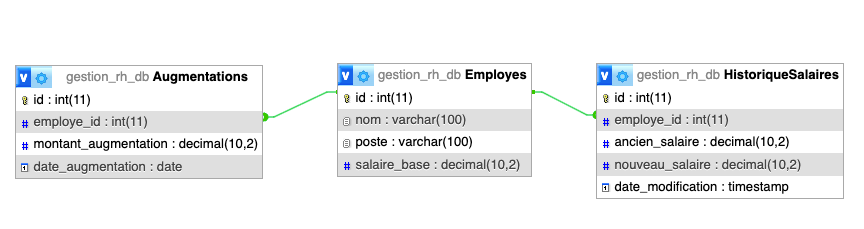

# Scenario 1 - Base de données gestion_rh

## Contexte
Vous travaillez pour une banque qui souhaite sécuriser les opérations sur les comptes de ses clients.
Votre mission est de mettre en place des triggers pour automatiser certaines vérifications et actions lors des transactions.

## Schéma de la base de données

## Missions

> ### Rappel des Règles de Gestion à implémenter
> - Toute modification du salaire de base d'un employé doit être enregistrée dans HistoriqueSalaires.
> - Lorsqu'une augmentation est accordée pour un employé, le salaire de base doit être automatiquement mis à jour en ajoutant le montant de l'augmentation.
> - Le salaire de base d'un employé ne peut pas dépasser 10 000 euros.

### 1 - Enregistrement des Modifications de Salaire
Créez un trigger pour enregistrer toute modification du salaire de base.

### 2 - Mise à Jour du Salaire lors de l'Attribution d'une augmentation
Créez un trigger pour mettre à jour le salaire de base de l'employé concerné en ajoutant le montant de l'augmentation.

### 3 - Limitation du Salaire Maximum
Créez un trigger pour empêcher que le salaire de base dépasse 10 000 euros.