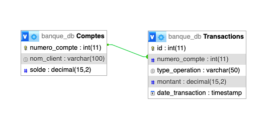

# Scenario 2 - Base de données banque_db

## Contexte
Vous travaillez pour une banque qui souhaite sécuriser les opérations sur les comptes de ses clients. 
Votre mission est de mettre en place des triggers pour automatiser certaines vérifications et actions lors des transactions.

## Schéma de la base de données

## Missions

> ### Rappel des Règles de Gestion à implémenter
> - Le solde d'un compte ne doit jamais être négatif.
> - Chaque opération de dépôt ou de retrait doit être enregistrée dans la table Transactions.

### 1 - Prévention du Découvert
Créez un trigger before update sur la table Comptes pour empêcher que le solde d'un compte ne devienne négatif suite
à un retrait.

### 2 - Enregistrement des Transactions
Créez un trigger after update sur la table Comptes pour enregistrer chaque opération de dépôt ou de retrait dans la
table Transactions.

### 3 - Limite de Retrait Quotidien
Supposons que la banque souhaite limiter le montant total des retraits à 3000 euros par jour et par compte. 

Créez un trigger pour implémenter cette règle.